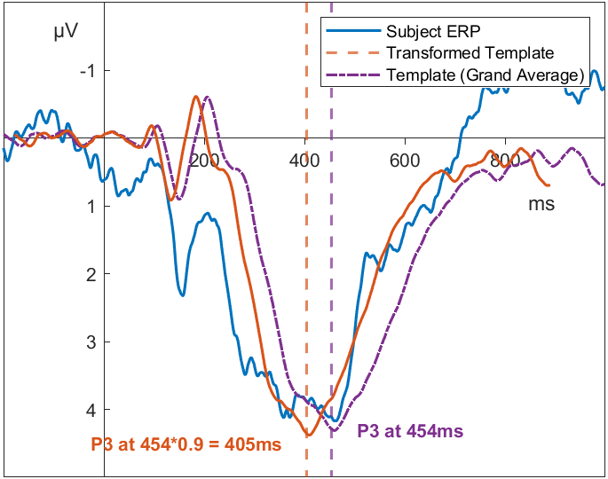

# Introduction
The latency of event-related potentials (ERPs) is a valuable measure of the speed of neuro-cognitive operations. This measure has been used to investigate the effect of experimental manipulations or individual differences in mental speed and has provided substantial insight into brain processes underlying cognitive functions. For example, a latent factor comprising individual latencies of the N2, P2, and P3 components in simple decision tasks has been shown to explain 80% of the variance in general intelligence [@schubert2017general]. However, testing differences between conditions or measuring individual differences in the latency of components, requires the extraction of latency estimates per subject. Such research based on individual estimates of latency requires extraction methods that provide consistently reliable and valid measures to ensure the replicability of results. 
So far, manual extraction of P3 latencies has yielded the most reliable and valid measures [@sadus2024explorative; @schubert2023robust]. However, manual extraction impairs objectivity and is inefficient, especially in the face of large data. Algorithms aiming to automate latency extraction, such as peak latency algorithms or fractional area latency algorithms, are time-effective and objective, but often lack in reliability or validity [@kiesel2008measurement; @sadus2024explorative; @schubert2023robust]. This paper introduces a novel algorithm for the automatic extraction of P3 latencies based on template matching. We aim to show that this new algorithm improves on existing approaches and enables more efficient, objective, reliable, and valid extraction of ERP latencies.

<!-- Algorithms aiming to automate latency extraction, such as peak latency algorithms or fractional area latency algorithms, are time-effective and objective, but often lack in reliability or validity [@kiesel2008measurement; @sadus2024explorative; @schubert2023robust]. Manually extracting latencies by inspecting each subject-level signal and directly picking peaks or adjust the measurement window by hand improves reliability and validity [@sadus2024explorative; @schubert2023robust]. However, this impairs objectivity and is inefficient, especially in the face of large data. So far, no approach has proven consistently reliable and valid as well as objective and efficient. This paper introduces a novel algorithm for the automatic extraction of P3 latencies based on template matching. We aim to show that this new algorithm improves on existing approaches and enables more efficient, objective, reliable, and valid extraction of ERP latencies. -->

In this paper, we chose to restrict our analysis to the P3 and provide proof-of-concept for this component before extending our work to other components. The P3 is one of the most widely used ERP components [@luck2014introduction; @donchin1981surprise] and is characterized by a positive-going deflection around 300 - 500ms after stimulus onset. It is related to higher-order cognitive processing and often associated with updating of information [@polich2007updating], stimulus classification [@duncan1981young] or response selection [@polich2007updating]. P3 latencies have been shown to be helpful for explaining individual differences in intelligence [@hilger2022biological; @schubert2023robust]. Given the widespread use of the P3 and its connection to numerous significant findings, we decided to concentrate on this in our initial paper.

## Latency Extraction Algorithms
The two approaches most commonly used to automatically extract component latencies are either based on the maximum voltage deflection within a fixed measurement window (peak latency) or the area under the ERP signal (fractional area latency) [@luck2014introduction]. Peak latency algorithms are based on the assumption that the point in time where maximum voltage deflection occurs is the best estimate of the latency of the true underlying component. However, high voltage deflections are sensitive both to high frequency noise and the superimposed signal of surrounding components [@luck2014introduction]. This influence of unrelated sources on the maximum voltage deflection challenges the central assumptions of peak latency algorithms [@luck2014introduction]. Additionally, @kiesel2008measurement presented an empirical challenge to peak latency approaches. They showed that the peak latency algorithm was unable to accurately recover simulated latency differences across a range of different components, including the P3. In addition to issues in recovering experimental effects, @sadus2024explorative demonstrate considerable issues in the reliability of P3 latencies quantified by the peak latency approach. In their multiverse study with varying pre-processing steps and experimental tasks, the peak latency approach often produced low reliabilities, showed poor homogeneity, and resulted in questionable effect size estimates. Manual extraction of individual P3 latencies proved to yield measures that were more consistently reliable and valid. Taken together, these methodological issues and empirical findings demonstrate that the peak latency algorithm is not a sufficiently reliable and valid algorithm that could replace manual quantification of ERP latencies.

Fractional area latency algorithms hope to remedy some of the methodological issues associated with the peak latency approach. Here, the area enclosed by the signal and some horizontal axis, most often the time-axis, within a fixed measurement window is used to estimate the latency of a component. Component latency is specified as the time that divides this area into a given fraction. The 50% area latency algorithm, for example, finds the time point that divides the area in two halves. Fractional area latency algorithms are unaffected by high frequency noise [@luck2014introduction]. Nonetheless, they remain highly sensitive to the measurement window specified by the researcher [@luck2014introduction]. A wider measurement window may include signal from surrounding components while a shorter measurement window may capture only a part of the signal of the component of interest. Compared to peak latency algorithms, fractional area latency algorithms showed better recovery of simulated latency differences, but also failed to consistently recover simulated experimental effects [@kiesel2008measurement]. Similarly, @sadus2024explorative revealed that fractional area latency algorithms were unable to consistently produce good reliabilites, homogeneities, and plausible effect sizes when extracting P3 latencies.

It should be noted that according to @kiesel2008measurement, the combination of jackknifing and the fractional area latency algorithm leads to the best recovery of simulated experimental effects in P3 latencies. In contrast, @sadus2024explorative found that jackknifing may lead to implausible effect sizes. Their results challenge the validity of using jackknifing in large samples. Furthermore, as jackknifing does not produce individual latency estimates, its application to individual differences research is inherently problematic.

Due to the issues of both peak latency algorithms and fractional area latency algorithms, manually extracting component latencies seems to remain the gold-standard regarding reliability and validity when individual differences are of interest [@sadus2024explorative]. All of the measurement pipelines that consistently produced desirable psychometric properties included manual extraction of component latencies [@sadus2024explorative]. However, manual extraction of latencies suffers from poor objectivity and low efficiency. An extraction algorithm that is sufficiently reliable and valid would greatly improve objectivity and efficiency.

## Template Matching
We aim to present an algorithm that can match the reliability and validity of human performance, while improving objectivity and efficiency. With the intention of matching human performance, we sought to embed some of the strategies used by human researchers into the latency extraction algorithm. 

Human researchers may be better at extracting ERP latencies because they use more information than traditional extraction algorithms. Before even investigating individual subject ERPs, most researchers inspect the grand averages in order to better understand the underlying ERP structure in their specific task, condition, and subject sample. When extracting the latency of subject-level ERPs, they are looking to identify the part of the signal that most closely resembles the component of interest in the grand average. This might not always be an exact match, amplitudes for the individual might be higher or the component might appear later, but the general shape of the component of interest will still be present. Expert researchers identify the part of the individual signal that best resembles the grand average component and then extract the subject's latency accordingly.

Similarly, our algorithm finds the closest match of the grand average to the individual subject-level ERP. To achieve this, we based our new algorithm on the concept of template matching. We use the grand average over all subjects as a template, which includes an idealized version of the component of interest. Then, the algorithm uses this template to identify the P3 in subject-level ERPs, by figuring out which part of the ERP best reflects the structure in the template. This mirrors the process expert ERP researchers use to extract individual latencies and allows the algorithm to use more of the available information.

Using the grand average as a template is ideal as it contains the average latency and average amplitude of a particular component. Nonetheless, subject-level ERPs differ from this grand average in both latency and amplitude. Quantifying these individual differences is the goal of our algorithm. With an estimate of the latency of the component of interest in the grand average and an estimate of the difference between the subject-level ERP and the grand average, the algorithm can recover individual latencies. To quantify individual differences in relation to the grand average, we use a dynamic template with variable latency and amplitude instead of only using the static grand average. This dynamic template is derived from the grand average by adding two free parameters that allow compressing or stretching both the latency and amplitude of the original grand average. Our algorithm then determines which transformed template shows the best fit to the subject-level ERP. For example, if the template amplitude needs to be stretched by a factor of 1.1 and its latency multiplied by 0.9 to best fit the subject-level ERP, then the subject-level latency is quantified as 0.9 times the grand average's component latency (see Figure \@ref(fig:introduction-example-img)).

(ref:introduction-example-img) Transforming the template to match an ERP
```{r introduction-example-img, fig.cap = paste("(ref:introduction-example-img)")}

```

Optimization of these free parameters is based on so called *similarity measures*. The similarity measure quantifies the fit of the transformed template to the subject-level signal. Different approaches to similarity measures are present in the template matching literature and fall into one of two camps: distance-based or correlation-based [@brunelli2009template; @mahalakshmi2012image]. These different approaches may result in different performance of the template matching algorithm [@goshtasby1984two; @brunelli1997template]. We therefore implemented a version of both types of similarity measures. The first is based on minimizing the squared distance (MINSQ) and the second is based on maximizing the correlation between the transformed template and the signal (MAXCOR).

If used without any further modification, all points of the signal would contribute equally to the similarity measure. However, as the component of interest in the grand average only consists of a part of the signal and does not incorporate all points in time, we tested the use of weighting windows that weigh the similarity measure depending on the time of the component of interest in the grand average. When extracting P3 latencies, which usually occur around 300-500ms [@luck2014introduction], early and late activity in the grand average should not influence the template matching procedure as much as the activity central to the P3. Using these weighting windows helps the algorithm to more closely mirror human behavior. Similarly, researchers manually extracting latencies focus on those parts of the signal where the component of interest occurs.

A focus on specific parts of the signal is also present in peak and area latency algorithms. Here it is introduced by the use of measurement windows. Activity outside of these fixed windows is not considered in peak latency or fractional area latency algorithms. Additionally, these measurement windows are applied to each subject-level ERP and directly influence what part of the signal is included. In our template matching algorithm, these windows are based on the grand average and do not directly indicate what part of the subject-level signal is included. Rather, they influence the template that is used during the template matching algorithm. To underline this difference, we will refer to windows set in the context of the template matching algorithm as *weighting windows*.

These weighting windows form the basis of a weighting vector used during the template matching procedure. Generally speaking, the difference (or correlation) between template and signal outside of that window is less important than the difference inside of the window.

## Testing 
We used the same data used by @sadus2024explorative and investigated both the psychometric properties of our new algorithm as well as the correlation with manually extracted latencies. This allows us to evaluate whether our new algorithm is a suitable replacement for the current gold-standard - manual extraction. Additionally, using data from this multiverse study allows us to investigate the impact of different tasks and pre-processing steps on the evaluated algorithms and provide insight into the conditions under which each algorithm performs best or worst.

We expanded this validation approach by a simulation study based on data used by @schubert2023robust in order to investigate how well a particular algorithm can recover a pre-specified true value. Since no simulation approach exists that can generate realistic ERPs with a known true latency, we simulated shifts in latency between experimental conditions similar to @kiesel2008measurement. We then evaluated how well peak latency, fractional area latency, and template matching algorithms recover those true simulated latency differences.

We hope to show that a template matching algorithm using the grand average as a variable template can successfully extract subject-level P3 component latencies. Ideally, use of this algorithm improves psychometric properties in comparison to prior algorithms, show high correlations with manually extracted data, accurately recover simulated latency shifts, and present an objective and efficient way to extract ERP latencies.