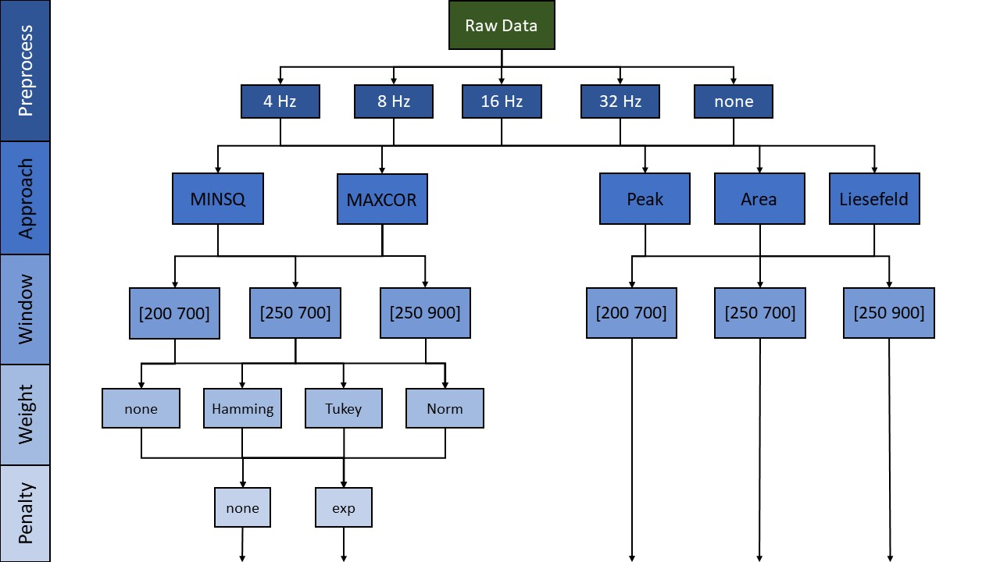

# Study 1
## Method
All analyses presented here are based on data originally published in @loffler2024common. The original data contain EEG recordings from 6 different tasks. We focused on the same three tasks that have been already selected by @sadus2024explorative.

### Participants
The empirical evaluation of our algorithm that is presented in the first part of this paper follows @sadus2024explorative. Their analysis used a sample of 30 young (18-21 years old, $M_{age}$ = 19.37, $SD_{age}$ = 0.76) and 30 old participants (50-60 years old, $M_{age}$ = 55.83, $SD_{age}$ = 2.87), representing the 30 youngest and 30 oldest participants from the overall study [@loffler2024common].

All participants had normal or corrected to normal vision. None of the participants had neurological or mental disorders, used psychotropic drugs, wore a pacemaker or suffered from red-green color vision deficiency. All participants provided informed consent prior to participation and received 75€ or course credit for participation.

### Tasks
All participants completed a set of three tasks: a Flanker Task, an Nback Task, and a Switching Task. Each assesses one of the executive functions proposed by @miyake2000unity. @loffler2024common programmed all tasks using MATLAB [@matlab2022b] and the software package Psychtoolbox (Version 3-0.13) [@kleiner2007psychtoolbox; @pelli1997videotoolbox; @brainard1997psychophysics]. We presented stimuli centrally against a black background and instructed participants to respond as quickly and accurately as possible.

#### Flanker Task
We employed a standard Arrow Flanker task [@eriksen1974effects] to evaluate a participant's _inhibition_ ability. A central arrow was flanked by additional arrows appeared on the screen, with the flanking arrows either pointing in the same or opposite direction to the central arrow. All participants had to identify the direction of the central arrow while ignoring the flanking arrows. Each participant completed practice trials followed by 100 congruent and 100 incongruent trials.

#### Nback Task
An adapted Nback task [@scharinger2015flanker] assessed participants' _updating_ abilities. During presentation of a stream of letters, participants had to indicate whether the current letter matched either a predefined target-letter (0-back condition) or the letter presented immediately before (1-back condition). In the original study, participants also completed a 2-back condition. Following @sadus2024explorative, we excluded this condition from the analysis. All participants completed practice trials and 96 trials per condition.

#### Switching Task
We administered a Switching task to measure participants' _shifting_ ability. We presented colored digits ranging from 1 to 9. Participants had to categorize them based on predefined rules signaled by a colored fixation cross before each trial. They had to either indicate whether the digit was greater than or less than 5 or whether the digit was odd or even. Participants either maintained the same rule as the previous trial or switched to the alternate rule. Each participant completed practice trials followed by 192 trials in both the repeat and switch conditions.

### Procedure
The original study consisted of three test sessions. The three tasks analyzed here were all conducted in the first session. The original study included two additional measurement occasions which we will not discuss further here. During EEG measurement, participants were seated approximately 140 cm from a monitor in a sound-attenuated room.

### EEG recording and processing
We continuously recorded EEG data using 32 equidistant Ag/AgCl electrodes and took additional electrooculogram (EOG) measures with two electrodes placed above and below the left eye to correct for ocular artifacts. We maintained all impedances below 5 kΩ. We recorded the signal with a sampling rate of 1000 Hz and online-referenced it to Cz. We removed artifacts using ICA on a cloned dataset down-sampled to 200 Hz and filtered with a high-pass filter of 1 Hz. We further removed line-noise using the CleanLine function [@mullen2012cleanline]. We detected bad channels using a z-value threshold of 3.29 as per the EPOS pipeline [@rodrigues2021epos] and interpolated channels that were removed following this procedure. Then, we re-referenced the data using an average referencing scheme. Based on a threshold of $1000 \ \mu V$ and excluding data more than 5 SDs away from the mean, we automatically detected and removed a maximum of 5% of segments per iteration containing artifacts in the ICA-dataset. We used the InfoMax algorithm in the ICA and applied the resulting decomposition to the original dataset. We removed ICs determined to be less than 50% likely to be brain activity by the ICLabel Algorithm [@pion2019iclabel]. Then, we low-pass filtered the data using a Butterworth filter with varying cutoff frequencies (4 Hz, 8 Hz, 16 Hz, 32 Hz, and no filter) and segmented it into 1200 ms epochs starting 200 ms prior to stimulus onset. Again, we automatically detected and removed segments containing artifacts. Finally, we baseline corrected segments using the 200 ms prior to stimulus onset. We conducted ERP analyses in MATLAB (Version 2024a) [@matlab2024a]. We only included correct trials in the analysis and investigated the P3 at the electrode Pz in accordance with existing literature [@polich2012neuropsychology; @verleger2020effects].

### Latency extraction techniques
We compared all versions of a template matching algorithm resulting from the combinations of similarity measures, weighting windows, weighting functions, and penalty methods to traditional approaches such as peak latency, fractional area latency, and the fractional area latency algorithm proposed by @liesefeld2018estimating. For peak latency and 50% area latency algorithms, we tried all weighting windows as measurement windows but focus on the results using the respective measurement windows used by @sadus2024explorative. Here, the peak latency algorithm is used with a window of 250 - 900 ms and the area latency algorithms with a window of 250 - 700 ms. See Figure \@ref(fig:method-overview-img) for an overview.

(ref:method-overview-img) Overview of extraction algorithms
```{r method-overview-img, fig.cap = paste("(ref:method-overview-img)")}

```

### Empirical evaluation
In order to compare our newly proposed algorithm to existing extraction methods, we applied all versions of the template matching algorithm as well as the peak latency algorithm, the 50% area latency algorithm, and the modified area latency algorithm [@liesefeld2018estimating; @wascher2022mental]. We focused on the reliability of latency values that are extracted by a particular algorithm and the intra-class correlation of latencies extracted by an algorithm vs. an expert ERP researcher (i.e. we used the manually extracted latencies from; [@sadus2024explorative].