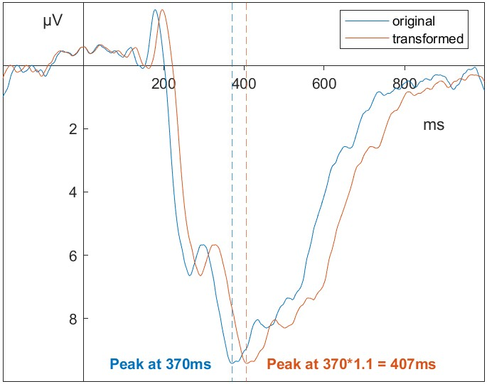
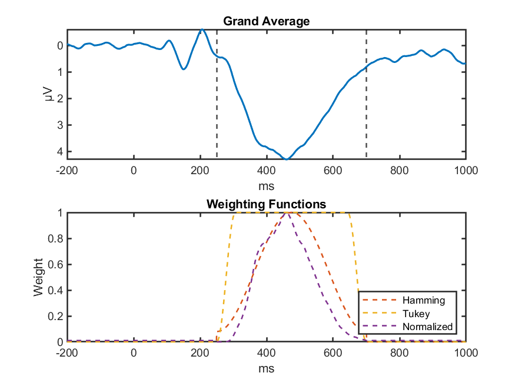

# Template Matching
The template matching algorithm is implemented in MATLAB (Version 2024a)^[Additionally, we use the Database Toolbox, the Optimization Toolbox, the Global Optimization Toolbox, the Parallel Computing Toolbox, and the Signal Processing Toolbox.]. Broadly, the algorithm can be divided into four steps: generation of the dynamic template, application of similarity weights, optimization, and recovery of latency from free parameters.

## Template Generation
We use the grand average ERP over all participants as a template and introduce two free parameters to allow the template to match individual differences in amplitude and latency. Both parameters lead to linear transformations of the template. The first parameter $a$ scales the entire template and adjusts for individual differences in amplitude. The second parameter $b$ stretches or compresses the entire template and adjusts for individual differences in time course.

Implementation of the parameter $a$ is straightforward: the entire template signal is multiplied by $a$. This results in linear transformations of the template along the amplitude axis. To implement the parameter $b$ that enables linear transformations along the time axis, we simply stretch or compress the signal along the x-axis. We then use spline interpolation to estimate the signal for a given transformed time-point. For example, if the template has a peak signal strength of $9.4\ \mu V$ at 370 ms and the transformation parameter $b = 1.1$, the transformed template will have the signal strength of $9.4\ \mu V$ at $370 \times 1.1$ ms. The signal strength at 370 ms will be equal to the spline interpolated signal strength of the untransformed template at $\frac{370}{1.1}$ ms (see Figure \@ref(fig:transformation-example-img)).

(ref:transformation-example-img) Transforming the latency of a signal using $b$
```{r transformation-example-img, fig.cap = paste("(ref:transformation-example-img)")}

```

The algorithm allows these two free parameters to transform the template along the time- and amplitude-dimension and then optimizes the parameters for maximum similarity between the transformed template and subject-level ERP.

## Similarity Measures
We chose to test two different approaches to similarity measures in this paper. The first approach minimizes the (weighted) squared distance between transformed template $t(a, b)$ and the signal $s$. It will be referred to as the MINSQ approach.

$$\underset{a, b}{\mathrm{argmin}} = \sum_i \omega_i(t_i(a, b) - s_i)^2.$$
The second approach aims to maximize the (weighted) correlation between transformed template $t(a,b)$ and signal $s$. It will be referred to as the MAXCOR approach.

$$\underset{a,b}{\mathrm{argmax}} = \frac{cov(t(a, b), s; \omega)}{\sqrt{cov(t(a, b), t(a, b); \omega)cov(s,s; \omega)}},$$
where
$$cov(t(a,b), s; \omega) = \frac{\sum_i \omega_i \cdot (t_i(a,b) - m(t(a, b); \omega))(s_i - m(s;\omega))}{\sum_i \omega_i},$$
and 
$$m(t(a, b); \omega) = \frac{\sum_i \omega_i t_i(a,b)}{\sum_i \omega_i}.$$
However, since the parameter $a$ linearly scales the template $t_i(a, b)$ along the time-axis and the MAXCOR approach relies on a weighted correlation that is invariant to linear transformations, the MAXCOR approach is not affected by $a$. We thus only optimized $b$ when using the MAXCOR approach and set $a = 1$.

## Weighting Vectors
In order to impart weights on the matching procedure that allow placing more importance on those parts of the signal where the component of interest occurs, we use a weighting vector $\omega$. Weighting windows indicate when the component of interest occurs. 

We tested three different weighting windows in order to investigate which size leads to the best template matching results. We implemented the two measurement windows used in @sadus2024explorative in order to compare our results to theirs. The first window has a range from 250 ms to 700 ms and the second window has a range from 250 ms to 900 ms. In order to include some of the activity of earlier components, we also tested a weighting window from 200 ms to 700 ms.

Weighting windows are then combined with a weighting function to generate the weighting vector used in the template matching algorithm. A simple function to generate this weighting vector would be to assign 0 to all values outside of the window and 1 to all values inside of that window. This rectangular window would correspond to a Tukey window with $\alpha$ = 0 [@bloomfield2004fourier] and is also referred to as a Dirichlet window. The rectangular shape of this weighting window suggests a sudden drop in the relevance of a mismatch just at the weighting window's borders. However, such a sudden cut-off is difficult to justify. Therefore, we tested two versions of weighting functions that include tapered edges.

We tested a Tukey window with $\alpha = 0.25$  and the Hamming window to slowly raise the weights from 0 outside of the measurement window to 1 inside the measurement window [@bloomfield2004fourier]. We also tested an additional weighting function that assigns weights based on the maximum-normalized amplitude of the grand average. Here the difference between transformed template and signal is of maximum importance at the peak of the component in the grand average and decreases in importance at lower amplitudes. See Figure \@ref(fig:weighting-functions-overview-img) for an overview of the different weighting functions. Additional information about the weighting functions can be found in the Appendix / supplementary materials.


(ref:weighting-functions-overview-img) Overview of weighting functions
```{r weighting-functions-overview-img, fig.cap = paste("(ref:weighting-functions-overview-img)")}

``` 

These weighting windows are defined based on the location of the component of interest in the grand average. In order to simplify the optimization, we chose to rescale the subject-level ERP along the time- and amplitude-dimension and fit it to the static grand average. Therefore, the actual implementation runs exactly opposite to the argument outlined here. This allows us to keep the weighting windows and weighting vectors constant and only transform the subject-level ERP signal. It has no impact on the fit statistic or the recovered latency.

## Penalty
In testing, we observed that the algorithms would occasionally converge on extreme values of $b$ when no clear solution could be identified. To mitigate this issue, we introduced a penalty function to the MAXCOR and MINSQ optimization functions. This penalty discourages any transformation where the signal latency deviates from the grand average by more than 50% (i.e., $b \le 0.\overline{6}$ or $b \ge 1.5$) by multiplying the value of the function by $e^b$ if $b \ge 1$, or by $e^{\frac{1}{b}}$ if $b < 1$. This ensures that large deviations from the grand average must show significant improvements in the optimization criteria should the algorithm converge on them. We intentionally only applied the penalty to $b \le 0.\overline{6}$ or $b \ge 1.5$ in order not to bias plausible values of $b$ towards 1. We tested all combinations of similarity measures, weighting windows, and weighting functions both with and without this penalty to ensure robustness and to observe the penalty's impact on convergence.

## Optimization
All combinations of similarity measures, weighting windows, weighting functions, and penalty functions optimize the similarity measure using on the GlobalSearch algorithm [@ugray2007scatter] implemented in the Global Optimization Toolbox [@matlab2024a]. This optimization algorithm uses a multistart heuristic approach to find the global minimum of a nonlinear differentiable function by evaluating multiple starting points for local minima. 

We set the parameter $a$ with lower and upper bounds of $[0.2, 20]$ and the parameter $b$ with bounds of $[0.3, 2]$. For the parameter $a$, we set the lower bound at 0.2 to avoid convergence near zero in cases where the signal is inconclusive and a flat line would fit the signal the best. We opted for an upper bound of 20, as a generous and liberal limit that worked well during testing. We selected 0.3 as the lower bound for $b$ because it seemed highly unlikely that an individual’s latency would differ from the grand average latency by more than a factor of three. However, due to how our implementation compresses the signal when $b$ increases, we encountered an issue where $b > 2$ led to over 50% missing entries in the transformed template. To address this, we chose 2 as the upper bound and 0.3 as the lower bound, establishing a more conservative yet practical range. These bounds are intentionally asymmetrical, reflecting the practical constraints of our implementation and the need to balance realism with the algorithm’s performance. During testing, these chosen bounds proved effective, helping to ensure that the algorithm did not converge on extreme or unrealistic values.

The algorithm returns both the optimal parameters as well as the resulting optimal similarity measure.

<!-- Additional information on the default settings of the optimization algorithm used in the template matching approach can be found in the supplementary materials **yeah?**. -->

## Fit
The optimal similarity measure returned by the algorithm can be used as an indicator of certainty. Very close fits of transformed template to subject-level ERP suggest a high degree of certainty and low impact of noise. Poor similarity measures, like correlations $r < 0.3$ suggest that even the optimal transformation of the component in the template does not closely resemble the component structure in the subject-level ERP. Therefore, we used of this fit statistic to remove latency estimates where even the best fit shows poor similarity between template and signal. Because the (weighted) correlation is easier to interpret, we used the correlation as an indicator of fit for both the MAXCOR and MINSQ approach and removed those latency estimates with correlations $r < 0.3$.

## Recovery of component latency 
We can use the set of optimal transformation parameters to recover the latency of subject-level ERPs. Prior to this, the latency of the component of interest in the grand average needs to be quantified. This can be done either manually or using one of the standard algorithms, like peak latency or fractional area latency. Due to the high signal-to-noise ratio of the grand average, applying these algorithms is much less problematic than in noisy subject-level ERPs. In our analysis, we use the 50% area latency algorithm proposed by @liesefeld2018estimating with the respective weighting window as a measurement window to determine the latency in the grand average.

The latency of the component in the grand average $l_{GA}$ is then multiplied by the optimal latency shift parameter of subject $j$ to obtain the latency in the subject-level ERP,

$$l_{GA} \cdot b_j = l_{j}.$$

## Other extraction methods
We defined peak latency as the time of maximum positive voltage deflection within a fixed measurement window which is also larger than the average of the three points both to the right as well as to the left of it [@luck2014introduction].

We determined fractional area latency using the 50% area latency approach. All signal below 0 was set to 0. Then we summed up the signal within the measurement window and extracted the two time-points between which the signal grows larger than 50% of the total. The exact latency was then determined through linear interpolation.

We also tested the modifications to fractional area latency suggested by @liesefeld2018estimating and subtracted half of the maximum amplitude from the signal as a relative baseline [see also @wascher2022mental]. Essentially, we set all signal below 50% of the maximum amplitude to 0. All other steps were identical to the steps taken in the regular 50% area latency algorithm.