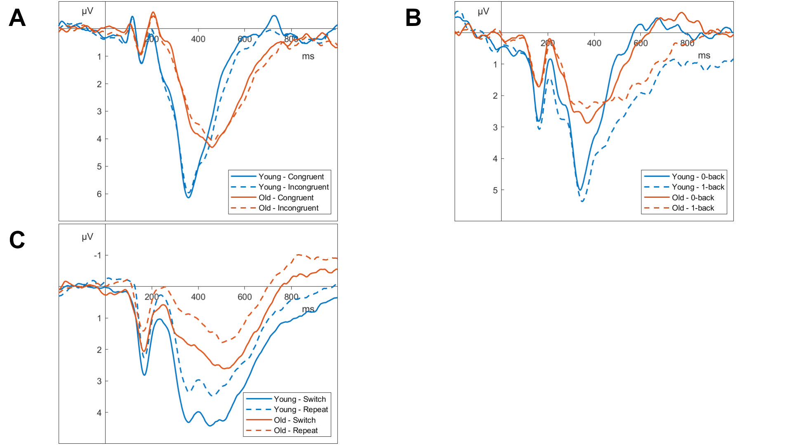

```{r}
source("markdown/analysis/icc_kathrin.R")
source("markdown/analysis/missing_kathrin.R")
source("markdown/analysis/reliability_kathrin.R")
```

## Results
We conducted all data preprocessing and statistical analyses using `r r_citations$r`. `r r_citations$pkgs` The grand averages for the three tasks in the empirical evaluation and the data containing the full set of participants used in the simulation are displayed in Figure \@ref(fig:grand-average-plots).

(ref:grand-average-plots) Grand Averages of the Tasks used at Pz with a 32 Hz low-pass filter
```{r grand-average-plots, fig.cap = paste("(ref:grand-average-plots)")}
# Define file paths for your images
image_paths <- c("images/ga_flanker_kathrin.png",
                 "images/ga_nback_kathrin.png",
                 "images/ga_switching_kathrin.png",
                 "images/ga_flanker_simulation.png")

# Load images into a list
images <- lapply(image_paths, png::readPNG)

ggplots <- lapply(images, function(x){
  return(ggplot() +
  annotation_custom(grid::rasterGrob(x), xmin = -Inf, xmax = Inf, ymin = -Inf, ymax = Inf) +
  theme_void())
})

# setup plot
arrange <- ggpubr::ggarrange(
  ggplots[[1]],
  ggplots[[2]],
  ggplots[[3]],
  # ggplots[[4]],
  labels = "AUTO"
)
ggsave("images/arranged_img_ga.jpeg", arrange, width = 16, height = 9, scale = 0.4)


```

<!-- We set latency estimates with bad template matching fit statistics ($r < 0.3$) and unreasonable estimates of $\beta$ ($\beta \le 0.5$ or $\beta \ge 1.9$) to NA in all analysis. We also excluded latency estimates more than 3 standard deviations away from the mean for the respective group of methods and participants.  -->

### Descriptive Statistics
The percentage of missing values varied systematically depending on the extraction algorithm (see Table \@ref(tab:overview-table-missing-kathrin)). Across tasks, preprocessing steps, weighting windows, weighting functions, and without a penalty the MINSQ algorithm resulted in `r mean_missing_minsq_nopenalty_kathrin` missing values and the MAXCOR algorithm in `r mean_missing_maxcor_nopenalty_kathrin` missing values. Penalizing more extreme transformation parameters reduced the percentage of missing values to `r mean_missing_minsq_penalty_kathrin` for the MINSQ algorithm and `r mean_missing_maxcor_penalty_kathrin` for the MAXCOR algorithm. The peak latency algorithm resulted in `r mean_missing_peak_kathrin` missing values, with `r mean_missing_area_kathrin` and `r mean_missing_liesefeld_kathrin` missing values for the area latency and modified area latency algorithm, respectively. For reference, the expert ERP researcher in @sadus2024explorative classified `r mean_missing_manual_kathrin` of individual ERPs as missing values.

(ref:overview-table-missing-kathrin) Missing values for different algorithms: empirical evaluation
```{r overview-table-missing-kathrin, tab.cap=paste("(ref:overview-table-missing-kathrin)"), tab.pos = "h", out.width="75%"}
knit_print(overview_table_missing_kathrin)
```

### Reliability
The reliability coefficients estimated using split-half correlations are reported in Table \@ref(tab:overview-table-rel-kathrin). Across tasks and preprocessing steps, the 50% area latency algorithm with the window used in @sadus2024explorative (250 ms - 700 ms) resulted in the highest average reliability (`r mean_reliability_area_kathrin`). Across tasks, preprocessing steps, weighting windows, weighting functions, and penalty settings, the MINSQ algorithm showed a mean reliability of `r mean_reliability_minsq_kathrin` and the MAXCOR algorithm a mean reliability of `r mean_reliability_maxcor_kathrin`. The best reliability for the template matching algorithms was achieved when using the MAXCOR algorithm with no weights and an exponential penalty (`r mean_reliability_by_method_kathrin %>% filter(approach == "maxcor", weight == "none", penalty == "exponential_penalty") %>% pull(mean_rel) %>% mean() %>% print_rel()`) or the MINSQ algorithm with normalized weights and an exponential penalty (`r mean_reliability_by_method_kathrin %>% filter(approach == "minsq", weight == "get_normalized_weights", penalty == "exponential_penalty") %>% pull(mean_rel) %>% mean() %>% print_rel()`). The modified fractional area latency algorithm resulted in an average reliability of `r mean_reliability_liesefeld_kathrin` and the peak latency algorithm in an average reliability of `r mean_reliability_peak_kathrin`.

(ref:overview-table-rel-kathrin) Reliability for different algorithms: empirical evaluation
```{r overview-table-rel-kathrin, tab.cap=paste("(ref:overview-table-rel-kathrin)"), tab.pos = "h", out.width="75%"}
knit_print(overview_table_rel_kathrin)
```


### Validity
Intra-class correlations between automatically extracted ERP latencies and those extracted by @sadus2024explorative can be found in Table \@ref(tab:overview-table-icc-kathrin). The choice of weighting function had considerable impact on the ICC. Hamming and Tukey weighting functions showed a mean `r mean_icc_hammingtukey_kathrin` across tasks, preprocessing steps, weighting windows, and template matching algorithms. The grand average normalized weighting functions showed a mean `r mean_icc_normalized_kathrin`.

Using the MINSQ or MAXCOR algorithm in conjunction with normalized weights yielded mean ICCs of `r mean_icc_minsq_normalized_kathrin` and `r mean_icc_maxcor_normalized_kathrin`, respectively. The peak latency algorithm showed a mean `r mean_icc_peak_kathrin`, the 50% area latency algorithm a mean `r mean_icc_area_kathrin`, and the modified area latency algorithm a mean `r mean_icc_liesefeld_kathrin`.

(ref:overview-table-icc-kathrin) ICC for different algorithms: empirical evaluation
```{r overview-table-icc-kathrin, tab.cap=paste("(ref:overview-table-icc-kathrin)"), tab.pos = "h", out.width="75%"}
knit_print(overview_table_icc_kathrin)
```